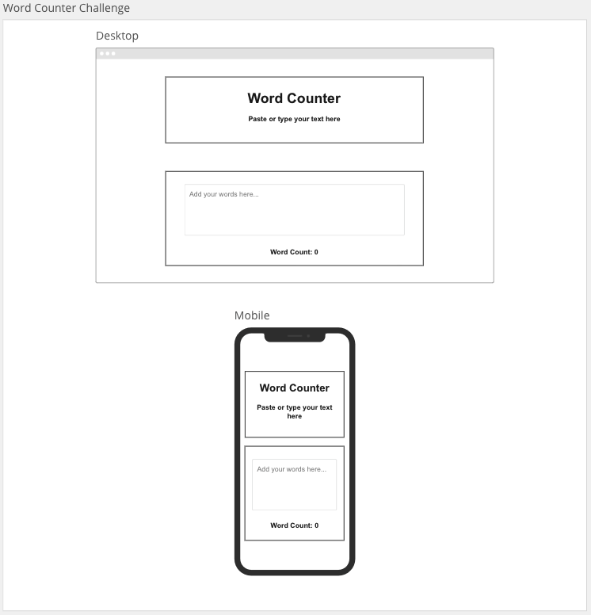

# Word Counter

## User Story

> As a user I want to be able to count the number of words in a given snippet of text.

## Acceptance Criteria

> Must contain a title of "Word Counter"

> Must contain a sub-title of "Paste or type your text here"

> Must contain a textarea where users can type text and the word count should update dynamically based on the number of words in the textarea

> User must be able to copy and paste text and the word count should update dynamically based on the number of words in the textarea

> Must display the result as follows `Word count: 100`

> Must display the result as follows on initial load as follows `Word count: 0`

## Design Guide

